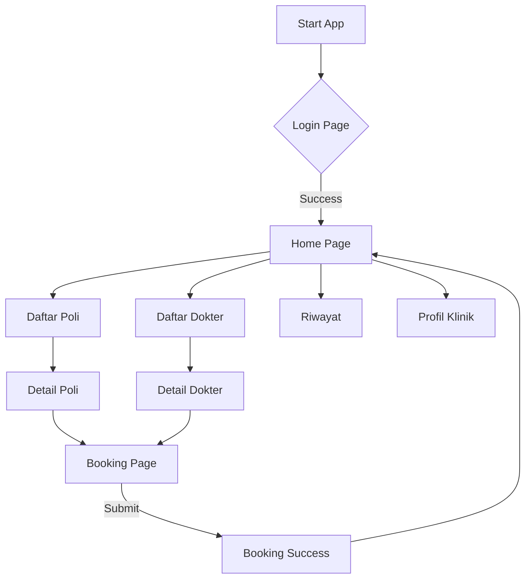

# Studi Kasus: Aplikasi Informasi Klinik Sehat Mobile

## 1. Deskripsi Proyek

**Nama Aplikasi**: Klinik Sehat

**Platform**: Mobile (Android) via Flutter

**Deskripsi Umum**:

Aplikasi Klinik Sehat adalah sebuah aplikasi mobile yang dirancang untuk memudahkan pasien dalam mengakses informasi layanan kesehatan. Aplikasi ini dibuat untuk sebuah klinik yang ingin mendigitalisasi penyampaian informasi kepada pasien mereka. Aplikasi ini berfungsi sebagai katalog digital interaktif yang memungkinkan pengguna melihat daftar poli, jadwal dokter, rincian layanan, dan mensimulasikan proses booking janji temu.

Aplikasi ini dikembangkan dengan pendekatan *frontend-first* menggunakan Flutter, di mana semua data saat ini disimpan secara lokal (mock data) untuk tujuan demonstrasi dan pembelajaran (UAS Pemrograman Aplikasi Bergerak).

## 2. Tim Pengembang

Proyek ini dikerjakan oleh kelompok mahasiswa:

1. **Yehezkiel Dio Sinolungan** (NIM: 2311032)
2. **Ahmad Fauzan Fadhilah** (NIM: 2311045)

## 3. Keputusan Desain (Design Decisions)

Salah satu aspek paling menonjol dari aplikasi ini adalah bahasa desain yang digunakan.

### 3.1. Filosofi Visual: "Organic Liquid"
Kami memilih menjauh dari desain aplikasi medis tradisional yang kaku (kotak-kotak, biru standar). Kami mengadopsi tema **"Organic Liquid"** yang bertujuan menciptakan suasana tenang ('Clinical Zen') bagi pengguna yang mungkin sedang cemas karena sakit.

*   **Bentuk Organik**: Menghindari sudut tajam. Kami menggunakan `BorderRadius` yang besar (32.0, 20.0) untuk menciptakan kesan lembut dan ramah.
*   **Warna**:
    *   **Primary**: Teal (`#1A7F7A`) - Memberikan kesan profesional namun menenangkan, berbeda dari biru rumah sakit standar.
    *   **Background**: `Zen White` (`#F9F9F7`) - Bukan putih murni yang menyilaukan, tapi sedikit hangat untuk kenyamanan mata.
    *   **Liquid Blue**: (`#E8F5F3`) - Digunakan untuk elemen latar belakang yang cair.
*   **Efek Kaca (Glassmorphism)**: Penggunaan `GlassCard` di berbagai halaman memberikan kedalaman visual modern tanpa membuat tampilan menjadi "berat".

### 3.2. User Experience (UX)
*   **Navigasi Intuitif**: Menu utama disajikan dalam bentuk *grid* besar di halaman beranda dengan ikon yang jelas, memudahkan akses cepat ke fitur utama.
*   **Transisi Halus**: Kami mengimplementasikan kustom transisi halaman (`DesignSystem.createRoute`) yang halus dan slide-in, mendukung tema "liquid" yang mengalir.
*   **Informasi Terstruktur**: Informasi kompleks seperti layanan medis dipecah menjadi hierarki: Poli -> Detail Poli -> Daftar Layanan Per Poli.

## 4. Fitur Aplikasi

### 4.1. Fungsionalitas (Functional Requirements)
Fitur-fitur yang dapat dilakukan pengguna dalam aplikasi:

1.  **Login**: Halaman masuk sederhana untuk autentikasi pengguna.
2.  **Dashboard Utama**: Menampilkan menu navigasi, jam operasional klinik, dan informasi pengembang.
3.  **Daftar Poli**: Melihat daftar spesialisasi yang tersedia (Umum, Gigi, Anak, Mata, THT, Kandungan).
4.  **Detail Poli & Layanan**:
    *   Melihat deskripsi poli.
    *   Melihat daftar layanan spesifik per poli dengan estimasi harga dan durasi.
    *   Navigasi drill-down dari Poli -> Layanan.
5.  **Daftar Dokter**: Melihat profil dokter yang tersedia di klinik.
6.  **Booking Janji Temu**: Formulir simulasi untuk membuat janji dengan dokter/poli tertentu.
7.  **Riwayat Periksa**: Menampilkan riwayat kunjungan pasien (data simulasi).
8.  **Profil Klinik**: Informasi tentang visi, misi, dan fasilitas klinik.

### 4.2. Non-Fungsionalitas (Non-Functional Requirements)
1.  **Estetika**: Tampilan antarmuka harus modern, bersih, dan menenangkan (UI Performance & Aesthetic).
2.  **Responsivitas**: Aplikasi berjalan lancar dengan *scroll* yang mulus (120Hz ready di perangkat yang mendukung).
3.  **Ketersediaan Data**: Data tersedia secara *offline* (embedded mock data), sehingga aplikasi cepat diakses tanpa loading internet.
4.  **Kompatibilitas**: Menggunakan Material 3 (`useMaterial3: true`) untuk standar desain terbaru Android.

## 5. Arsitektur & Teknologi

### 5.1. Struktur Data (Mock Data)
Aplikasi tidak menggunakan database eksternal. Data dimodelkan menggunakan Dart Class dan diinstansiasi sebagai list konstan. Ini memungkinkan relasi data (Poli memiliki banyak Layanan) tetap terjaga meskipun tanpa database SQL.

### 5.2. Diagram Alur (Flowchart)

### 5.3. Struktur Package
*   `lib/`
    *   `main.dart`: Entry point.
    *   `design_system.dart`: Pusat konfigurasi tema (Warna, Font, Variabel UI).
    *   `components/`: Widget reusable (misal: `GlassCard`).
    *   `model/`: Definisi struktur data (`Poli`, `Doctor`, `Booking`).
    *   `page/`: Layar aplikasi (`HomePage`, `LoginPage`, dll).

## 6. Kesimpulan
Aplikasi Klinik Sehat Mobile berhasil mengimplementasikan kebutuhan dasar informasi klinik dengan pendekatan desain yang unik. Penggunaan Flutter memungkinkan kami membuat UI custom ("Organic Liquid") yang konsisten dengan performa tinggi. Meskipun backend masih berupa simulasi, struktur kode yang rapi (pemisahan Model, View/Page, dan Design System) memudahkan pengembangan lebih lanjut jika ingin dihubungkan ke API nyata di masa depan.
